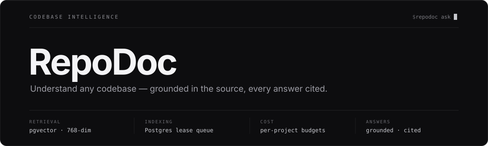

<div align="center">
  
</div>

<br />

# RepoDoc

**Codebase RAG built as infrastructure: retrieval runs over what each file *means*, indexing is a durable Postgres lease queue, and every token is metered against a per-project budget.**

[Live](https://repodoc.parbhat.dev) · [Source](https://github.com/parbhatkapila4/RepoDocs)

---

## The problem

Most of the work in understanding a codebase isn't reading the file you have open — it's finding the three files you didn't know to open. Onboarding to an unfamiliar repo means reconstructing a mental model that lives nowhere: which module owns auth, where the rate limit is configured, what actually runs on a cron. Grep finds strings; it doesn't find concepts. Documentation, when it exists, drifts from the code the day after it's written.

"RAG over a codebase" is the obvious answer and the obvious trap. The demo is easy: chunk the files, embed the chunks, retrieve top-k, call an LLM. It falls apart on contact with real repos for reasons that have nothing to do with prompting. Raw code embeds *lexically* — variable names and syntax — so a query like "how does authentication work" retrieves whatever file happens to share tokens with the question, not the file that implements the concept. And ingesting a whole repository is a systems problem, not a model problem: it has to survive serverless time limits, partial failures, and the fact that an LLM call per file turns "index this repo" into an unbounded bill.

## The thesis

RepoDoc takes four opinionated positions, and they're the reason it behaves differently from a generic RAG wrapper.

**Embed what a file means, not what it says.** During indexing, each file is summarized by an LLM into a ≤100-word description of its purpose (`getSummariseCode`), and *that summary* is embedded — `gemini-embedding-001` at 768 dimensions — not the raw source. Retrieval is then a cosine search over intent (`1 - (embedding <=> query)` against pgvector, top-5). The alternative — chunking source by lines or AST nodes — embeds the wrong signal and ranks by surface similarity. The cost of this choice is an extra LLM call per file at index time and a hard dependency on summary quality; the payoff is that "where are rate limits configured" retrieves the rate limiter even when the query shares no tokens with it.

**The database is the queue.** Indexing is not a request; it's a job. RepoDoc models it as an `IndexingJob` row in Postgres with a lease, not as a call to SQS or Redis or BullMQ. A worker claims a job with an atomic compare-and-swap, holds a five-minute lease, and releases it on completion or failure. One datastore, transactional with the data it indexes, no extra infrastructure to operate. The tradeoff is that work is pulled (cron + on-demand kicks) rather than pushed, and this isn't built for tens of thousands of jobs per minute — but at this scale, a queue service would be operational overhead with no payoff.

**Cost is a runtime constraint on the query path.** Every request through `/api/query`, `/api/analyze-diff`, `/api/repo-changes` and `/api/architecture` writes a `QueryMetrics` row (model, prompt/completion tokens, latency, estimated USD, retrieval and memory counts, cold-start and cache flags, success/error). A project can set `monthlyCostLimitUsd`; once 30 days of recorded spend crosses it, those routes return `402` before any model call. Stated precisely, because the gap matters: **README generation, docs generation and per-file summarization during indexing are not metered and not budget-checked.** They use the most expensive models in the product (`gemini-2.5-pro`, Claude Haiku) and the largest payloads, and they can run past a project's limit without being counted. Closing that is the next real piece of work on this pillar, not something the current code does.

**Durable repo memory, separate from retrieval.** RepoDoc extracts facts from each Q&A exchange into a `RepoMemory` store and pulls the top matches back as secondary context on later questions — capturing intent and decisions that live in conversations, not in any file. It's labeled distinctly from code in the prompt, under one rule: when memory and code conflict, the code wins.

One more thing, stated precisely because precision is the point: all generation goes through OpenRouter, with the model picked per route — `gemini-2.5-flash` for chat (temperature 0.3), `gemini-2.5-pro` for README generation, Claude Haiku for docs. Gemini's API is called directly only for embeddings. This keeps model selection a one-line change. To be exact about what *isn't* here: there is no automatic cross-provider failover. The codebase earns the word "fallback" only in the cost model, which defaults unpriced models to the Gemini Flash rate so a request is never silently billed at zero.

## Architecture

```
  Connect              Index (background)                    Query
  ───────              ──────────────────                    ─────
  GitHub URL  ──▶  IndexingJob (queued)            POST /api/query
       │            │                                    │
       │            ▼  triggers:                          ▼  auth → rate-limit → ownership → budget
       │      • on project create                        │
       │      • on query vs unindexed project       embeddings == 0 ?
       │      • daily Vercel cron (0 6 * * *)            ├── yes ─▶ pre-index: live-fetch ≤22
       ▼            │                                    │          high-value files from GitHub
  worker claims ◀───┘                                    │          (answer now, kick worker)
  job via lease (CAS)                                    └── no  ─▶ pgvector top-5  +  RepoMemory top-3
       │                                                            │
       ▼  per file: summarize → embed → store                       ▼
  LangChain GithubRepoLoader                            OpenRouter (gemini-2.5-flash)
       │  summary → gemini-embedding-001 (768d)         grounded answer + cited sources
       ▼                                                            │
  Postgres + pgvector (HNSW, cosine)  ◀──────────────────────────────┘
       │                                                  write QueryMetrics, cache, extract memory
       ▼
  IndexingJob.progress / status (retry, cancel, resume in UI)
```

The connect step stores the repo and an (optionally encrypted) GitHub token and enqueues a job. The worker — invoked on demand and by a daily cron backstop — claims a job, walks the repo with LangChain's `GithubRepoLoader`, and for each file summarizes then embeds then writes a pgvector row. Querying guards the request, then either answers from the index or, if indexing hasn't produced embeddings yet, live-fetches a curated set of files from GitHub so the project is useful immediately.

## Why this is hard

These are the parts that took real engineering, each tied to where it lives:

- **Claiming a job exactly once under concurrent workers.** `claimJob` (`indexing-worker-run.ts`) is a conditional `updateMany` — it flips `queued`/`stale-processing` → `processing` and trusts the claim only when `res.count === 1`. Two workers that wake on the same job can't both win; it's a compare-and-swap on the row, no advisory locks.
- **Surviving the serverless 60-second wall.** Indexing a large repo can't finish in one invocation. The worker time-boxes itself (`WORKER_BUDGET_MS`), and when it runs out it writes a `resumeAfter` cursor, requeues the job, and re-kicks — so indexing makes forward progress across many short runs instead of dying at the platform timeout.
- **Recovering a dead worker without double-processing.** A lease is five minutes. A job stuck in `processing` with `lockedAt` older than that is reclaimable; `@@index([status, lockedAt])` makes finding it cheap. A crashed worker's job is picked up by the next one and resumed from its cursor.
- **Being useful before indexing finishes.** `queryCodebasePreindex` fetches up to 22 high-value files (READMEs, configs, entrypoints) straight from the GitHub tree and answers from those, flagging the response `preindex: true`, while kicking the indexer in the background.
- **Bounding spend before the model call.** `isProjectOverBudget` sums 30 days of `QueryMetrics` and short-circuits the query, diff and architecture routes to `402` before any tokens are spent. The indexer's own `needsResume` is a *time* box (`WORKER_BUDGET_MS`, 45s), not a cost one — it exists to survive the serverless wall, and does not consult the budget.

## Design decisions & tradeoffs

- **Decision:** Embed LLM summaries, not raw code. **Why:** code embeds lexically; intent is what you query by. **Tradeoff accepted:** an LLM call per file at index time, and retrieval is only as good as the summaries.
- **Decision:** Postgres as the job queue (lease + CAS), no queue service. **Why:** one transactional datastore, nothing extra to run. **Tradeoff accepted:** polling, not push; not built for very high job throughput.
- **Decision:** OpenRouter as the single chat gateway. **Why:** swap or route models per task without SDK churn, one billing surface. **Tradeoff accepted:** an extra network hop and no native multi-provider failover.
- **Decision:** Budget enforced in the request path (`402`) and mid-index (pause/resume). **Why:** AI cost is unbounded by default; a ceiling has to be live to matter. **Tradeoff accepted:** a hard limit can interrupt indexing, which is why jobs are resumable.
- **Decision:** Rate limiting and secret encryption both **fail open**. **Why:** for a single-operator product, a Redis blip or an unset key shouldn't 500 every request. **Tradeoff accepted:** a deliberately weaker posture under those failures — documented below, not hidden.

## Failure modes

- **Worker dies mid-index.** Its lease expires after five minutes; the next worker reclaims the job and resumes from the `resumeAfter` cursor. No stuck jobs, no re-embedding from scratch.
- **Serverless invocation times out.** The time-box requeues with a cursor before the platform kills the function; indexing continues on the next invocation.
- **Project queried before it's indexed.** The pre-index path answers from live GitHub fetches and marks the result `preindex: true`, so the user isn't blocked.
- **Project exceeds its budget.** Queries, diff analysis and architecture requests return `402` with a clear message before calling a model. Indexing is unaffected — it neither reports spend nor checks the limit, so a large index can still run while the query path is closed.
- **Redis unavailable / provider error.** The rate limiter falls back to a per-instance in-memory window (weaker across instances, but never a 500). During indexing, each summary and embedding is retried twice with backoff; a persistent failure marks the job `failed` with the error string, surfaced in the UI for retry.

## Security model

- **Auth.** Clerk middleware guards everything except an explicit public allow-list (`middleware.ts`); each API route re-checks the session and returns `401`. Every request-path project lookup is scoped by owner and `deletedAt: null`. Three lookups omit the filter and are safe for a stated reason rather than by accident: two run server-side on a `projectId` already validated upstream (`baseline-mirror.ts`, the indexer), and the third resolves names for IDs that came out of an already owner-scoped set (`analytics`).
- **Admin role.** `/api/analytics` has a privileged mode: an allow-list of admin emails (`getAdminEmails()`) switches the query scope from one owner to platform-wide. It is email-gated, not a separate credential.
- **Input & SQL.** Zod validates request bodies. There are nine raw-SQL sites — pgvector similarity search and embedding writes, repo-memory read/write, chat-history read/write, a plan lookup, a project aggregate, and the health check's `SELECT 1`. Every one is a tagged template, so Prisma parameterizes it; `$queryRawUnsafe`/`$executeRawUnsafe` appear nowhere in the codebase.
- **Secrets at rest.** Stored GitHub tokens are encrypted with **AES-256-GCM** in an envelope format `enc:v1:<base64(iv|tag|ciphertext)>` (`secret-crypto.ts`), keyed by `ENCRYPTION_KEY`. Honest caveat: if `ENCRYPTION_KEY` is unset, the code falls back to storing plaintext so the app keeps working — set the key in every environment to actually get encryption.
- **Webhooks.** The Clerk webhook verifies the **svix HMAC signature** and rejects on mismatch (fail-closed). The cron worker route authorizes with a constant-time (`timingSafeEqual`) shared-secret check.
- **Billing webhook.** The Gumroad billing webhook authenticates with a constant-time shared-secret check, maps a product permalink to a plan, and auto-downgrades to Starter on refund, chargeback, or cancellation.
- **Rate limiting.** Per-identity fixed-window limiting, preferring the platform-set `x-real-ip` over the spoofable `x-forwarded-for`, returning `429` with `Retry-After`; it fails open under store failure — a deliberate availability-over-strictness tradeoff.

Not claimed because it isn't built: there is no documented data-retention or training-data policy in the codebase, and no key rotation beyond the `enc:v1:` version prefix that makes it possible later.

## Tech stack

Next.js 16.0.7 (App Router, React 19.2) · TypeScript 5 · Tailwind 4.1 · PostgreSQL + pgvector (HNSW, cosine) via Prisma 6.16 · Clerk 6.31 (auth) · OpenRouter for generation, Google `gemini-embedding-001` for embeddings · Redux Toolkit · Zod 4 · Upstash Redis (rate limiting) · svix (webhooks) · Gumroad (billing) · Jest 29 · Vercel.

Vector search runs against an HNSW index on the embedding column with cosine distance (`vector_cosine_ops`) — an approximate-nearest-neighbour lookup, not an exact scan. The index SQL used to sit in a loose file outside any timestamped migration directory, so `prisma migrate deploy` never ran it; it now lives in `20260805000000_apply_orphaned_sql_and_vector_indexes` and applies with the rest. No benchmark compares it against a sequential scan on real row counts, so no speedup figure is claimed here — only the mechanism.

## What's intentionally not built yet

- **Automatic cross-provider LLM failover** — a single OpenRouter gateway today; model selection is per-task, not failover. Deferred until provider outages are a real operational problem.
- **Multi-tenant / team seats** — projects are single-owner today. Multi-seat lands when there's a multi-seat customer, not before.
- **Metering and budget enforcement on the generation paths** — README generation, docs generation and indexing-time summarization write no `QueryMetrics` row and never consult `monthlyCostLimitUsd`. The plumbing exists and the query path uses it; extending it to those three is a known gap, called out here rather than left to be discovered.
- **A measured retrieval benchmark** — the HNSW index is in place, but nothing here times index-vs-scan or measures recall against exhaustive search, so this README claims the mechanism and no numbers. Benchmarks land when there's a row count big enough to make them mean something.
- **Async, batched embedding pipeline + dedicated vector store** — one Postgres+pgvector instance handles ingestion and retrieval today. Sharded or batched embedding when a single database is the bottleneck.
- **Integration / e2e tests against a live database** — the suite is unit-level (below). End-to-end coverage waits until the data layer's shape stabilizes.

## Run locally

```bash
git clone https://github.com/parbhatkapila4/RepoDocs.git
cd RepoDocs
npm install
cp .env.example .env   # then fill in the values below
npm run db:generate
npm run db:migrate
npm run dev            # http://localhost:3000
```

Requires Node 20+ and a PostgreSQL instance with the `pgvector` extension.

`RepoMemory` and `CodebaseQueries` have no Prisma model — they are reached through raw SQL — and until `20260805000000_apply_orphaned_sql_and_vector_indexes` they were created only by loose files that `migrate deploy` skipped. That migration now creates both, so `npm run db:migrate` is sufficient on a clean database.

Environment variables actually read by the code:

```env
DATABASE_URL=            # Postgres (pooled)
DIRECT_URL=              # Postgres (direct, for migrations)
NEXT_PUBLIC_CLERK_PUBLISHABLE_KEY=
CLERK_SECRET_KEY=
CLERK_WEBHOOK_SECRET=
GEMINI_API_KEY=          # embeddings
OPENROUTER_API_KEY=      # all generation
ENCRYPTION_KEY=          # 32-byte key; without it, stored tokens are NOT encrypted
CRON_SECRET=             # authorizes the indexing-worker cron route
GITHUB_TOKEN=            # optional; raises rate limits and enables private repos
UPSTASH_REDIS_REST_URL=  # optional; distributed rate limiting/locking
UPSTASH_REDIS_REST_TOKEN=
RESEND_API_KEY=          # contact form; without it /api/contact returns 503, never a false success
CONTACT_TO_EMAIL=        # optional; defaults to parbhat@parbhat.work
CONTACT_FROM_EMAIL=      # optional; defaults to onboarding@resend.dev — see caveat below
NEXT_PUBLIC_APP_URL=http://localhost:3000
```

One caveat on the contact form, because "it posts successfully" and "the mail arrived" are different claims: `CONTACT_FROM_EMAIL` defaults to `onboarding@resend.dev`, Resend's shared sender, which requires no domain verification but **only delivers to the address registered on the Resend account**. Mail reaches an arbitrary `CONTACT_TO_EMAIL` only once a domain is verified in Resend and `CONTACT_FROM_EMAIL` points at an address on it. A rejected send is surfaced — the route logs it and returns 502/503, and the form shows the error plus the direct email address, never a success toast. What is *not* covered: Resend accepting a message and bouncing it later is asynchronous, and with no delivery webhook wired up that failure is invisible to the sender.

## Tests

36 tests across five suites (`npm run test:ci`), fully mocked — route guards on `/api/query` (401/400/404/200 and the pre-index path), RAG retrieval and answer generation, the GitHub loader, the architecture graph's import resolver, and a claim-drift guard that fails the build if an unbacked performance or capability claim reappears on a public surface. They cover behavior and error handling at the function and route-handler level; there is no live-DB integration or end-to-end coverage yet (see "not built yet").

Stated plainly rather than left to be discovered: that's ~3.4% line coverage against a 50% threshold configured in `jest.config.js`, so `npm run test:coverage` fails on the threshold while `npm run test:ci` passes. The tests that exist are the ones guarding the query path and the public claims; the number is low because the suite is deliberately narrow, not because the threshold is aspirational.

## About

Built by Parbhat Kapila — a full-stack engineer focused on production AI systems. More work at [parbhat.dev](https://parbhat.dev).
